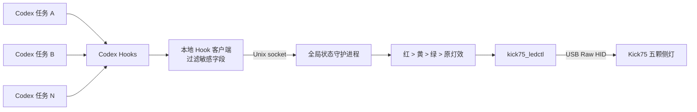

# Codex Kick75 Status Lights

[](LICENSE)

把 OpenAI Codex 的全局任务状态映射到 NuPhy Kick75 IO 的 5 颗侧灯。

| 全局状态 | 侧灯 | 判定规则 |
| --- | --- | --- |
| 需要处理 | 红色 | 任一任务等待权限，或出现可识别的工具失败 |
| 执行中 | 黄色 | 没有异常，且至少一个任务正在执行 |
| 全部完成 | 绿色 | 所有仍被跟踪的任务均已完成 |
| 空闲 | 原灯效 | 没有活跃任务；恢复接管前的侧灯配置 |

多个 Codex 任务按 `session_id` 独立跟踪，全局优先级为：

```text
红色 > 黄色 > 绿色 > 原灯效
```

绿色默认保持 10 秒，然后自动恢复键盘原来的侧灯效果。

> [!IMPORTANT]
> 当前版本仅验证了 macOS + NuPhy Kick75 IO（USB VID/PID `19f5:1026`）。
> 任意 RGB 控制依赖 USB 原始 HID，蓝牙连接不能使用本项目的灯光控制功能。

## 功能特点

- 汇总 Codex App 和 Codex CLI 的多个并行任务。
- 通过一个用户级后台进程串行访问 USB HID，避免多个 Hook 争用键盘。
- 首次接管灯光时读取并保存原侧灯状态；空闲或服务停止时自动恢复。
- Hook 只向本机守护进程发送事件名、任务 ID、轮次 ID 和失败布尔值。
- 不传输或记录用户提示词、工具参数、工具输出正文。
- 不修改主键区灯效、键盘固件或键盘持久化设置。
- 安装时合并 `~/.codex/hooks.json`，不会覆盖已有的其他 Hooks。
- 支持安装、状态检查、手动复位、硬件测试和卸载。
- 无第三方 Python 依赖。

## 工作原理



Codex Hook 事件与本项目状态的映射：

| Hook | 任务状态变化 |
| --- | --- |
| `UserPromptSubmit` | 任务进入执行中 |
| `PermissionRequest` | 任务进入需要处理状态 |
| `PostToolUse` | 显式失败时标红；成功时回到执行中 |
| `Stop` | 无粘性错误时标记完成 |
| `SessionEnd` | 从跟踪列表移除任务 |

官方 Hook 输入包含 `session_id` 和 `turn_id`，详见
[Codex Hooks 文档](https://learn.chatgpt.com/docs/hooks)。

## 环境要求

- macOS。
- NuPhy Kick75 IO，USB VID/PID 为 `0x19f5:0x1026`。
- 键盘通过 USB 数据线连接，而不是仅使用蓝牙。
- Python 3.9 或更高版本；macOS 自带的 `/usr/bin/python3` 可用。
- Xcode Command Line Tools，用于编译 C 语言 HID 控制器。
- 支持生命周期 Hooks 的 Codex CLI/App。

检查编译器：

```bash
clang --version
```

如果没有 `clang`：

```bash
xcode-select --install
```

## 快速部署

### 1. 获取项目

```bash
git clone https://github.com/<your-account>/<your-repository>.git
cd <your-repository>
```

### 2. 先做可恢复硬件测试

```bash
/usr/bin/python3 scripts/install.py test-hid
```

预期结果：5 颗侧灯变成绿色约 5 秒，然后恢复测试前的侧灯效果。

该测试不会修改主键区灯效或固件。如果灯没有变化，请先查看
[故障排查](#故障排查)。

### 3. 安装

```bash
/usr/bin/python3 scripts/install.py install
```

安装器会自动完成：

1. 使用 `clang` 编译 `src/kick75_ledctl.c`。
2. 把运行文件安装到 `~/Library/Application Support/CodexKick75/`。
3. 创建用户级 LaunchAgent：
   `~/Library/LaunchAgents/com.zzm.codex-kick75.plist`。
4. 合并全局 Codex Hooks 到 `~/.codex/hooks.json`。
5. 启动后台状态守护进程。

如果 `hooks.json` 已存在，修改前会创建带时间戳的备份。

### 4. 让 Codex 加载 Hooks

完全退出 Codex App（`Command + Q`），然后重新打开。不要只关闭窗口。

也可以打开 Codex CLI：

```bash
codex
```

进入 CLI 后运行：

```text
/hooks
```

核心事件应显示 `Installed 1` 和 `Active 1`：

- `UserPromptSubmit`
- `PermissionRequest`
- `PostToolUse`
- `Stop`

如果 Codex 要求审查或信任 Hook，请确认命令指向：

```text
/Users/<你的用户名>/Library/Application Support/CodexKick75/codex_kick75_hook.py
```

### 5. 验证真实任务

在 Codex 中提交：

```text
请执行 sleep 8，完成后只回复“测试完成”
```

预期灯光顺序：

```text
黄色约 8 秒 → 绿色约 10 秒 → 恢复原灯效
```

## 常用命令

所有管理操作都通过同一个脚本完成：

```bash
/usr/bin/python3 scripts/install.py <command>
```

| 命令 | 作用 |
| --- | --- |
| `build` | 仅编译 HID 控制器 |
| `install` | 编译并安装/更新服务和 Hooks |
| `status` | 查看服务、Hook、当前灯色和任务数 |
| `reset` | 清空陈旧任务并恢复接管前的侧灯效果 |
| `test-hid` | 绿色 5 秒硬件测试，然后自动恢复 |
| `uninstall` | 移除本项目 Hooks、LaunchAgent 和运行文件 |

也可以使用 Make：

```bash
make build
make test
make install
make status
make reset
make test-hid
make uninstall
```

## 自定义计时

安装时可以调整完成绿灯时长和陈旧任务超时：

```bash
/usr/bin/python3 scripts/install.py install \
  --green-hold 15 \
  --stale-task-hours 6
```

- `--green-hold`：全部完成后保持绿色的秒数，默认 `10`。
- `--stale-task-hours`：Codex 异常退出且没有发送结束事件时，任务自动过期的小时数，默认 `12`。

重新运行 `install` 会更新 LaunchAgent 并重启服务。

## 多任务汇总示例

| 任务 A | 任务 B | 全局灯色 |
| --- | --- | --- |
| 执行中 | 执行中 | 黄色 |
| 已完成 | 执行中 | 黄色 |
| 已完成 | 等待权限 | 红色 |
| 执行中 | 工具失败 | 红色 |
| 已完成 | 已完成 | 绿色 |
| 无活跃任务 | 无活跃任务 | 原灯效 |

红色是粘性状态：如果任务在等待权限或工具明确失败，`Stop` 不会立即把它改成绿色。
同一任务重新提交提示词，或后续工具成功执行后，会回到黄色。

## 查看运行状态

```bash
/usr/bin/python3 scripts/install.py status
```

示例：

```text
service: running
hooks:   5/5 installed
light:   yellow
tasks:   2
state:   /Users/me/Library/Application Support/CodexKick75/state.json
```

运行文件和诊断信息位于：

```text
~/Library/Application Support/CodexKick75/
├── codex_kick75_common.py
├── codex_kick75_daemon.py
├── codex_kick75_hook.py
├── kick75_ledctl
├── daemon.log
├── state.json
└── status.sock
```

查看日志：

```bash
tail -f "$HOME/Library/Application Support/CodexKick75/daemon.log"
```

日志最多约 1 MiB，超过后轮换为 `daemon.log.1`。日志只记录聚合灯色、任务数量和硬件错误，
不记录提示词或工具内容。

## 故障排查

### `/hooks` 显示 Active 0

1. 确认项目所在目录已被 Codex 信任。
2. 确认 `~/.codex/hooks.json` 存在。
3. 在 `/hooks` 中审查并信任本项目 Hook。
4. 使用 `Command + Q` 完全退出 Codex App，然后重新打开。

Hooks 默认启用；如果配置中显式关闭过，请删除该覆盖，或设置：

```toml
[features]
hooks = true
```

### Hooks Active 1，但灯不变

检查后台服务：

```bash
/usr/bin/python3 scripts/install.py status
```

如果服务未运行，重新安装：

```bash
/usr/bin/python3 scripts/install.py install
```

确认键盘是 USB 连接，并关闭其他可能同时访问 NuPhy 原始 HID 的灯效程序。

### 灯一直是黄色或红色

Codex 可能异常退出，没有发送 `Stop` 或 `SessionEnd`。安全复位：

```bash
/usr/bin/python3 scripts/install.py reset
```

这会清空内存中的任务状态并恢复最初保存的侧灯配置。

### `Kick75 IO not found`

- 更换支持数据传输的 USB 线。
- 重新插拔键盘。
- 确认设备 VID/PID 是 `19f5:1026`。
- 确认不是仅通过蓝牙连接。

可用系统命令查看 USB 设备：

```bash
system_profiler SPUSBDataType
```

### `raw HID open failed`

- 退出 NuPhyIO 或其他键盘配置程序后重试。
- 重新插拔键盘。
- 检查 LaunchAgent 日志：

```bash
tail -n 100 "$HOME/Library/Application Support/CodexKick75/daemon.log"
```

### 安装时找不到 clang

```bash
xcode-select --install
```

安装 Command Line Tools 后重新运行安装命令。

## 卸载

```bash
/usr/bin/python3 scripts/install.py uninstall
```

卸载器会：

1. 只从 `~/.codex/hooks.json` 移除包含 `codex_kick75_hook.py` 的条目。
2. 保留其他项目和插件的 Hooks。
3. 停止 LaunchAgent；停止过程中恢复接管前的侧灯效果。
4. 删除本项目安装到 `~/Library/Application Support/CodexKick75/` 的运行文件。
5. 修改 Hooks 前保留时间戳备份。

卸载后完全退出并重新打开 Codex。

## 开发与测试

项目没有第三方运行时依赖。

```bash
make all
```

等价于：

```bash
/usr/bin/python3 scripts/install.py build
PYTHONPYCACHEPREFIX=/tmp/codex-kick75-pycache \
  /usr/bin/python3 -m unittest discover -s tests -v
```

测试覆盖：

- 多任务红、黄、绿优先级。
- 红色粘性状态和成功恢复。
- 完成任务自动过期。
- `SessionEnd` 清理。
- Hook 数据最小化，避免传递提示词和工具正文。
- 安装器合并 Hooks 时保留已有配置。
- 卸载器只删除本项目 Hook。

## 项目结构

```text
.
├── Makefile
├── README.md
├── CHANGELOG.md
├── .github/workflows/ci.yml
├── docs/
│   └── PROTOCOL.md
├── research/
│   ├── extract-webpack-module.mjs
│   └── inspect-nuphy-light-api.mjs
├── scripts/
│   ├── install.py
│   └── send_test_event.py
├── src/
│   ├── codex_kick75_common.py
│   ├── codex_kick75_daemon.py
│   ├── codex_kick75_hook.py
│   └── kick75_ledctl.c
└── tests/
    ├── test_common.py
    ├── test_daemon.py
    └── test_installer.py
```

`research/` 中的脚本仅用于还原 NuPhyIO 灯光数据结构，不参与安装或运行。
协议说明见 [docs/PROTOCOL.md](docs/PROTOCOL.md)。

## 已知限制

- 目前只支持 macOS。
- 目前只验证 Kick75 IO `19f5:1026`。
- 5 颗侧灯作为一个整体显示同一状态，未做逐灯任务映射。
- 蓝牙 HID 没有本项目所需的任意 RGB 写入通道，因此必须使用 USB。
- Codex `Stop` Hook 不提供明确的 `completed/failed` 枚举。本项目通过
  `PermissionRequest` 和 `PostToolUse` 的显式失败字段判断红色，不能识别所有自然语言层面的阻塞。
- NuPhy 固件或 NuPhyIO 协议更新可能改变 HID 数据格式。

## 安全说明

本项目仅发送以下已验证的灯光相关 HID 命令：

- 建立临时会话密钥。
- 读取灯光状态。
- 写入侧灯 8 字节状态。

不会发送固件升级、恢复出厂、键位映射或未知命令。即便如此，这是非官方工具；请自行承担使用风险。
建议首次部署前先执行 `test-hid`。

本项目与 OpenAI、NuPhy 无隶属或官方合作关系。Codex 和 NuPhy 是各自所有者的商标。

## License

本项目采用 [MIT License](LICENSE) 开源。

你可以自由使用、复制、修改、合并、发布、分发、再许可和销售本项目代码，
但必须在副本或主要部分中保留原版权声明和 MIT 许可证文本。

## 发布到 GitHub

仓库已通过 `.gitignore` 排除 macOS `._*` 元数据、编译产物、Python 缓存和运行日志。

```bash
git init
git add .
git commit -m "Initial release: Codex Kick75 status lights"
git branch -M main
git remote add origin https://github.com/<your-account>/<your-repository>.git
git push -u origin main
```
