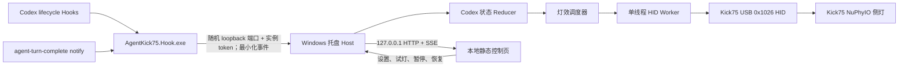

# Kick75 Codex 状态灯：Windows MVP 实现计划（USB）

> 版本：v0.3（USB 单连接收敛）
> 日期：2026-08-01
> 当前阶段：M1–M3 软件实现已完成收敛与自动化/浏览器验证；USB profile 已通过 M1 真机闸门，
> 应用运行时固定使用 USB，不提供 Auto、dongle 或连接路径切换；M2 Thinking → Complete 真机链路已通过，NuPhyIO 真机 `DeviceBusy` 验收已按用户决定延期

## 1. 结论先行

采用“**Fork 原始 Pixelmoss 项目 + 在 Fork 内新增 Windows/.NET 平台层 + 从 alvis 版本定向吸收改进**”的混合方案。

- Git 历史基线选择 [Pixelmoss/codex-kick75-status-lights](https://github.com/Pixelmoss/codex-kick75-status-lights) 的 `v0.2.0`。它本身就是 Codex-only，状态模型、Hook 隐私裁剪、侧灯原状态保存/恢复和测试最贴合本期目标。
- [alvis-HaoH/agent-kick75-status-lights](https://github.com/alvis-HaoH/agent-kick75-status-lights) 作为第二上游和实现参考，选择性吸收呼吸灯调度、灯效安全结论、重连和协议研究；不把 Claude/Kimi、多 Agent 轮播和多页 macOS UI 一并带入 MVP。
- Windows 运行时使用新的 C#/.NET 代码实现，不逐行翻译 Python、C/IOKit 和 SwiftUI；但复用上游协议规范、行为契约、测试向量和 MIT 来源历史。
- 运行形态是**当前用户的 Windows 托盘进程**。它常驻接收 Codex Hooks、独占 HID、维护状态；设置界面是由托盘进程在 loopback 地址提供的本地静态页面。
- MVP 只面向 USB 直连 `0x1026`。U1/2.4G 研究记录仅作为历史安全证据保留，不进入运行时枚举、选择或写入路径。
- 第一技术闸门不是 UI，而是 Windows USB 真机完成：**读取侧灯原状态 → 显示绿色 5 秒 →
  逐字节恢复原状态**。该闸门已于 2026-08-01 通过。

这既不是原样移植，也不是与上游脱离的纯 greenfield：仓库与协议继承上游，Windows 平台代码保持干净的新边界。

## 2. Fork 还是从零开始

| 方案 | 优点 | 主要代价 | 结论 |
| --- | --- | --- | --- |
| Fork Pixelmoss | Codex-only；代码和测试规模较小；保留最直接的协议、状态机和 MIT 历史 | 需要从 alvis 补入少量后续经验 | **采用** |
| Fork alvis | 灯效和多 Agent 经验较新；测试覆盖更广 | 当前目标只做 Codex，却会先承接 Claude/Kimi、逐 Agent 配置、轮播和 UI 复杂度 | 暂不采用；作为第二上游 |
| 新建纯 greenfield 仓库 | 目录和技术栈最自由 | 容易重新引入协议、安全、恢复与 Hook 隐私方面的错误；来源追踪变差 | 不采用 |

若短期目标改变为同时支持 Claude Code/Kimi Code，应在开始 M2 前重新评估是否改以 alvis 为主线。仅做 Codex 时，Pixelmoss 是更小、更清晰的起点。

### 2.1 仓库来源策略

计划中的远端关系：

- `origin`：本项目自己的 GitHub Fork；
- `upstream`：Pixelmoss 原始项目；
- `alvis`：alvis 派生项目，只用于比较和定向移植。

本次调研固定的代码快照是 Pixelmoss [`e32648e`（`v0.2.0`）](https://github.com/Pixelmoss/codex-kick75-status-lights/commit/e32648ee86a8a729734060ac09bd7f8a1213876f)和 alvis [`bf2dcb4`](https://github.com/alvis-HaoH/agent-kick75-status-lights/commit/bf2dcb48f2c87c1794d524b9194d9aae96827cc4)。真正执行 Fork 前先复核两条主线的新提交，不无审查地追随浮动 `main`。

必须保留原 `LICENSE`、原提交历史和版权声明，并新增衍生来源说明。移植 alvis 的具体代码时，在提交信息或 `NOTICE.md` 中记录来源提交。

当前本地目录创建计划时为空且尚不是 Git 仓库。实际启动 M0 时先创建远端 Fork，再把本目录接到 Fork 的历史；本计划文件作为第一个 Windows 规划提交加入，避免另建一个失去上游历史的新仓库。

## 3. MVP 范围

### 3.1 本期必须完成

- Windows 11 x64、当前用户进程，不要求管理员权限；
- Kick75 **NuPhyIO 固件版** USB 直连 `VID 0x19F5 / PID 0x1026`；
- 固定 USB profile，不提供 Auto、dongle fallback 或连接路径切换；
- 使用 Codex 官方 lifecycle Hooks 获取状态；
- 一个托盘进程、一个 Hook 入口、一个本地设置页；
- 侧灯显示 Thinking、Requires input、Complete，空闲时恢复用户原灯效；
- 多个 Codex 会话同时存在时按统一优先级聚合到一组侧灯；
- 拔插重连、暂停、退出和异常重启时尽最大努力恢复原侧灯状态；
- 可重复安装和卸载 Hooks，不破坏用户已有 Hooks。

### 3.2 明确不在 MVP 内

- Claude Code、Kimi Code 或其他 Agent；
- macOS/Linux 运行时重写；
- Kick75 QMK/VIA 固件版；
- 蓝牙灯控；
- U1/2.4G 接收器灯控或运行时诊断；
- 其他 NuPhy 型号或其他接收器；
- 键位、主键区 RGB、固件升级或 bootloader 操作；
- Microsoft Store、MSIX/MSI、winget 和正式代码签名；
- React/Node 前端、云服务、账号系统或远程控制；
- 把浏览器 WebHID 当作常驻主通道。

Kick75 High 的当前可观察 USB PID 是 `0x1027`，但不进入运行时选择。`0x0720/0x0721`、U1 boot PID `0x1020` 等升级模式 PID 永不进入灯控白名单。

### 3.3 已确认的设备事实与支持边界

2026-07-31 在当前 Windows 开发机进行了只读枚举和官方网页静态取证，没有发送灯光写命令：

| 项目 | USB 直连 | U1 2.4G 接收器 |
| --- | --- | --- |
| VID/PID | `0x19F5:0x1026` | `0x19F5:0x2620` |
| Windows/官方名称 | `NuPhy Kick75 IO` | `Kick75 IO Dongle` / `NuPhy U1 Dongle` |
| 控制接口 | Usage Page `0x0001`、Usage `0x0000` | `MI_03`，Usage Page `0x0001`、Usage `0x0000`，`HID_IsReadOnly = FALSE` |
| HID 报告 | Report ID `0`，64 字节协议帧 | 官方 NuPhyIO 对该接口同样使用 Report ID `0` 和 64 字节发送缓冲 |
| 官方关联 | Kick75 IO app PID | Kick75 IO 的 `dongleIds` 指向 U1 Dongle；前端设备配置为 `dongleType: "U1"` |
| 侧灯能力 | Kick75 协议已在上游及本次 Windows USB 闸门验证 | 官方前端为 Kick75 声明 `sideLight: 5`，但通用 U1 capability 未证明可直接发送 Kick75 D6 |
| 当前结论 | `Verified`：当前设备与回退固件组合 | Diagnostic-only；禁止写入 |
| 尚缺证据 | 修正后的实现尚未在 `v4.0.18` 上复测 | 远端 Kick75 身份、独立协议 envelope 与后续真机门槛 |

官方配置与本机 HID descriptor 证明 U1 capability 存在，但当前 NuPhyIO 只把 `0x1026` 纳入
Kick75 keyboard API；这不足以证明可向 `0x2620` 直接发送 Kick75 D6。因此 U1 的诊断结论仅作为
历史证据保留，不进入当前运行时的枚举、选择或写入路径。USB 的 `Verified`
结论来自 2026-08-01 的真机往返与逐字节恢复，仅适用于当次设备与回退固件组合。

## 4. Codex 状态语义

[Codex Micro 官方说明](https://learn.chatgpt.com/docs/features/codex-micro)给出的 Agent Key 语义是：Idle 白、Thinking 蓝、Complete 绿、Requires input 琥珀、Error 红，未分配时熄灭；选中的会话会脉冲显示。

Kick75 只有一组共享侧灯，且 Hooks 没有“用户已读完成消息”事件，因此 MVP 做以下有意识的映射：

| 内部状态 | 来源 | 侧灯行为 | 与 Codex Micro 的差异 |
| --- | --- | --- | --- |
| `Idle` | 无活动会话 | 恢复接管前保存的 8 字节侧灯状态 | 默认不强制白色；页面可后续提供“Micro 风格白色”选项 |
| `Thinking` | `UserPromptSubmit`；等待结束后的 `PostToolUse` | 蓝色呼吸 | 对齐官方蓝色语义 |
| `RequiresInput` | `PermissionRequest`；`PreToolUse` 匹配 `request_user_input` | 琥珀色闪烁或呼吸 | 对齐官方琥珀色语义 |
| `Complete` | `Stop` | 绿色保持 10 秒，然后退出该 turn 的显示竞争 | 10 秒是“未读”状态的近似，因为 Hooks 没有 read 回调 |
| `Error` | 暂无可靠的会话级 Hook | 语义预留，MVP 状态类型不新增或伪造红灯 | 普通工具失败不等同 Codex 会话失败 |

不要把一次非零工具退出直接映射成红色：Codex 往往会继续纠正。如果以后官方提供可靠的 turn/session failure 事件，或真机/真实会话验证出稳定字段，再启用 `Error`。

### 4.1 多会话聚合

每个 `session_id` 只保存一条当前状态；`turn_id` 仅保留为最近事件的诊断标识。灯光优先级为：

```text
RequiresInput > Interrupted > Thinking > Complete > Idle
```

- 任一会话等待用户时，整组侧灯显示琥珀色；
- 否则，只要仍有会话运行，就显示蓝色；
- 否则显示最近完成 turn 的绿色，最长 10 秒；
- 所有会话均退出竞争后恢复原灯效；
- `SessionEnd` 删除会话；另设可配置的 stale 清理，避免 Codex/Hook 异常退出后永久残留状态。

若后续启用可靠的 `Error`，建议优先级为 `RequiresInput > Error > Thinking > Complete > Idle`。

## 5. 总体架构



### 5.1 技术栈

- `.NET 10 LTS` + C#；使用 self-contained 发布，用户无需预装 .NET。微软当前支持计划中 .NET 10 支持到 2028-11；
- WinForms `NotifyIcon` + .NET Generic Host：实现无主窗口托盘进程；
- ASP.NET Core Minimal API/Kestrel：只绑定 loopback，并从程序集提供原生 HTML/CSS/JavaScript；
- loopback HTTP：Hook 进程使用每次 Host 启动发布的随机端口和实例 token 投递事件；
- `NamedPipeServerStream`：当前用户 CLI `status` 与 Host 诊断通道；
- Win32 HID/SetupAPI P/Invoke：枚举复合 HID 接口并进行异步 input/output report 读写；
- xUnit：协议、状态、配置、安装器和模拟 HID 测试。

首版不嵌入 WebView2。点击托盘菜单的“打开控制页”时使用系统默认浏览器，可减少运行时依赖；页面关闭不影响 Hook 或灯光。

### 5.2 建议目录

```text
src/windows/
  AgentKick75.Core/          # Hook 归一化、状态 reducer、灯效、配置、协议 codec
  AgentKick75.Hid.Windows/   # SetupAPI/HID、热插拔、超时、设备能力筛选
  AgentKick75.App/           # WinExe、托盘、Host、Pipe、HTTP、命令子模式
    wwwroot/                 # index.html、app.js、styles.css，发布时嵌入
  AgentKick75.Hook/          # 控制台 Hook helper，保证 Stop 的 stdin/stdout 契约
tests/windows/
  AgentKick75.Core.Tests/
  AgentKick75.Protocol.Tests/
  AgentKick75.Integration.Tests/
docs/
  WINDOWS_CODEX_MVP_PLAN.md
  WINDOWS_TEST_MATRIX.md      # M1 后记录真实硬件组合
```

M0 基线验证完成后，工作树精简为 Windows/.NET 实现；上游 macOS/Python/C 运行文件不再随当前版本分发。原 `v0.2.0` 标签、完整 Git 历史、`LICENSE` 和固定来源引用继续保留，协议行为仍可按提交逐项审计。

## 6. 关键模块设计

### 6.1 托盘主程序与 Hook helper

运行时包含托盘主程序和一个轻量控制台 helper：

- 无参数：启动单实例托盘 Host；
- `AgentKick75.Hook.exe hook codex`：读取 stdin Hook JSON、投递经实例 token 认证的 loopback 入口；Stop 向 stdout 返回空 JSON 对象后退出；
- `hardware-test`：固定使用 USB profile 执行读取/绿灯/恢复测试；
- `install`：安装用户级 Hooks 和登录启动项；
- `uninstall`：恢复灯效并只移除本项目写入的配置；
- `status`：通过专用 allowlist DTO 输出设备和 Host 状态，设备身份只保留 `VID:PID`，不包含
  raw HID path、serial、baseline 确认 ID 或会话正文。

托盘菜单至少包含：打开控制页、暂停/恢复接管、恢复原灯效、硬件测试、开机启动、退出。

Host 使用当前用户单实例锁。首版不使用 Windows Service，避免 Session 0、用户配置目录、托盘交互和 HID 句柄隔离问题。

### 6.2 Codex Hook

使用[官方 Hooks](https://developers.openai.com/codex/hooks)，不读取 Codex 的 SQLite、历史文件或 transcript。安装器合并用户级 `~/.codex/hooks.json`，并使用官方 `commandWindows` 指向打包后的 EXE。

MVP 注册：

| Hook | 处理 |
| --- | --- |
| `UserPromptSubmit` | `Thinking` |
| `PreToolUse`，仅匹配 `request_user_input` | `RequiresInput` |
| `PermissionRequest` | `RequiresInput` |
| `PostToolUse` | 从等待态回到 `Thinking`；不把任意工具错误升级为会话 Error |
| `PostToolUse` + `update_goal(status=blocked)` | 持久 `Interrupted`，直到下一次 `UserPromptSubmit` |
| `Stop` | 当前不是 `RequiresInput` 或 `Interrupted` 时进入 `Complete`，并使用 TTL |
| `SessionEnd` | 直接删除 session |

若当前 Codex Desktop 界面不派发 Stop，helper 使用官方 `agent-turn-complete` notify 补充同一
Complete 事件，并继续转发用户原有 notify 命令；只提取 thread/turn 标识，不传输消息正文。

Hook helper 必须：

- 仅读取允许列表字段：`hook_event_name`、`session_id`、`turn_id`、`tool_name`；不再传递状态机
  不需要的 tool ID；
- 不保存或传输 `prompt`、`tool_input`、`tool_response`、`last_assistant_message`、transcript 内容；
- stdin 设置大小上限，JSON 缺字段时安全忽略；
- Stop 向 stdout 输出上游要求的空 JSON 对象，其他 Hook 保持静默；固定快速超时，Host 不在线时
  fail-open、退出码仍为 0，不阻塞 Codex；
- 安装后明确提示用户通过 Codex `/hooks` 检查并信任配置；
- 对 Hooks 合并、去重、备份和卸载建立 fixture 测试。

官方当前只执行 command handler，异步 command 尚未支持，因此“同步 Hook 极短、真正处理转交常驻进程”是硬性设计约束。

### 6.3 进程间通信

- Pipe 名称包含当前用户 SID 的哈希，并使用 `CurrentUserOnly` 限制到当前登录用户；
- 每条消息是有长度上限的版本化 JSON envelope；
- Host 收到后先做 schema/事件允许列表验证，再交给状态 reducer；
- `status-response` 不直接序列化内部恢复 snapshot；Host 与 CLI 两侧都按字段和格式重新裁剪；
- 不在 Windows 上复用上游的 `os.kill(pid, 0)` 探活。若增加 PID 健康检查，使用 `OpenProcess(PROCESS_QUERY_LIMITED_INFORMATION)`、进程创建时间和退出码，防止 PID 复用及误终止进程；
- `SessionEnd` 不是即时的：官方说明切走会话并不会立刻结束 session。因此还需 stale 清理和真机场景验证。

### 6.4 本地静态控制页

页面由托盘 Host 提供，不让页面直接持有 HID。最低功能：

- 当前聚合状态、活动会话数量和最后事件时间；
- 安全裁剪的设备 manufacturer/product、连接类型、接收器状态、键盘响应状态和 HID descriptor
  `bcdDevice`；不得把该 descriptor 版本宣称为 NuPhyIO 固件版本；
- Thinking/RequiresInput/Complete/Interrupted 的颜色、静态/呼吸/流光、亮度、流光速度与完成保持时长；
- 3 秒试灯，以及一个“暂停并恢复 / 恢复接管”生命周期操作；
- 开机启动偏好开关（M4 才写入 HKCU Run）和诊断日志入口；
- 通过 SSE 实时刷新，无需 WebSocket 和前端构建工具。

API 草案：

```text
GET  /api/v1/status
GET  /api/v1/settings
GET  /api/v1/diagnostics?limit=50 # 持久脱敏日志的固定 allowlist DTO
PUT  /api/v1/settings
POST /api/v1/preview/{state}
POST /api/v1/pause
GET  /api/v1/events              # SSE
```

Kestrel 只监听随机 loopback 端口；严格检查 Host/Origin/Fetch Metadata，不开放 CORS；写操作
需要每次 Host 启动生成的随机 token 和自定义 header。SSE 单独限制连接数、订阅背压和写入时限；
网页不能从局域网访问，设备诊断也不公开 HID path 或 serial。

### 6.5 HID 与协议安全边界

上游已研究出的核心协议保持不变：

- 唯一运行时 profile 是 `kick75-usb`，使用 `VID 0x19F5 / PID 0x1026`；
- USB 必须继续按 `Usage Page 0x01`、`Usage 0x00` 和 65 字节原生 input/output report 筛选复合 HID 接口，不能只取同 VID/PID 的第一个接口；
- Report ID 为 `0`；协议帧 64 字节；Windows 真机已确认原生 input/output 均使用外层 65 字节
  缓冲区（Report ID 0 + 64 字节协议帧）；
- 仅允许 `0xEE` 会话、只读 `0xA0` 获取活动 `currentMode`、`0xD5` 读取灯态、`0xD6` 写灯态；
- `0xA0` payload byte 0 只接受 `0` 或 `1`；D5/D6 byte 7 必须编码该活动 mode，baseline journal
  同时保存 mode，恢复时不允许静默切换 bank；
- 只允许侧灯完整 block `address=9,length=8`，以及该 block 内的 brightness 字节 `address=10,length=1`；禁止任意地址写入，不写主键区；
- 完整保存并恢复原始 8 字节，不能仅按 RGB 重新构造用户灯效；
- 固件模式 `0x04` 有持久关闭风险，绝不用于动画的“灭相”；
- U1、High 和 bootloader/upgrader 身份不参与运行时设备选择；
- 所有 HID 操作由单一 worker 串行，严格验证响应方向、命令、长度、checksum、session key 和超时；
- bootloader/upgrader PID 不进入白名单，应用不包含任何固件写入 opcode。

NuPhy 官方 NuPhyIO 页面当前也使用 WebHID、Report ID 0 和 64 字节命令，这是网页直连可行性的佐证，但其压缩后的网页脚本不是稳定公开 API。正式运行时仍由托盘进程持有设备。WebHID 仅可作为后续显式诊断模式，而且启用前必须让 Host 释放 HID 句柄。

### 6.6 配置、基线和日志

数据目录：`%LOCALAPPDATA%\AgentKick75\`。

- `config.json`：版本化 schema，临时文件 + 原子替换；
- `lighting-restore.json`：运行时第一次 D6 前原子写入，仅保存 schema、设备身份、接口指纹、
  `currentMode` 和原始侧灯 8 字节；文件存在即表示恢复责任未完成，D5 读回确认后删除；
- `baseline.json` 只供显式硬件测试事务使用，不承载 Host 生命周期或 Codex 状态；
- 异常重启先处理 `lighting-restore.json`；身份、接口或 transport 不匹配时直接删除旧记录且绝不向
  当前键盘写入旧灯态，mode 不匹配或读回失败则 fail-closed；
- Codex 会话、聚合状态、暂停意图、Worker 状态和生命周期均只在内存中实时派生，不落盘；
- 持久诊断只保留 Host/HID 状态转换和允许列表错误码，按大小/天数轮转；诊断目录在
  logger 生命周期内由不共享 DELETE 的 Windows handle 固定，create/read/delete 使用
  `OPEN_REPARSE_POINT` 的同一已验证文件 handle，并拒绝 reparse point 和多硬链接文件；
  活跃 reader 必须在释放目录/文件句柄前排空，文件数上限在删除失败时 fail-closed，读取在
  同一已锁定 handle 上先检查文件大小上限；
- 本地文件使用受保护的 Windows ACL，仅允许当前用户、LocalSystem 和本机 Administrators；不记录 prompt 或其他正文。

## 7. 实施里程碑

### M0：建立 Fork 和行为基线（约 0.5 天）

- 创建 Pixelmoss Fork，配置 `upstream` 与 `alvis` 两个来源；
- 记录采用的上游 commit/tag，保留 MIT 归属；
- 在 Windows 上跑上游纯逻辑测试，单独处理 POSIX `0600` 断言，不通过删除测试来“修复”；
- 建立 .NET 10 solution、CI 和协议 golden fixtures；
- 把 MVP 支持矩阵写入 `WINDOWS_TEST_MATRIX.md`。

验收：仓库历史和许可证完整；Core/Protocol 空项目可编译；上游已知逻辑测试结果有记录。

### M1：Windows HID 硬件闸门（约 2–3 天）

- 实现 USB `0x1026` 的设备枚举、interface capability 输出和严格筛选；
- 实现纯 `Kick75ProtocolCodec` 及 checksum/XOR/golden tests；
- 实现 `0xEE/0xA0/0xD5/0xD6` 和超时、ACK 校验；USB 先读取活动 `currentMode`，D6 严格执行
  同 handle 的 `9/8 → 10/1`；公开 lighting transport 只允许完整 pair，不提供单片 D6 入口；
- 运行 `hardware-test`：读 baseline，绿灯 5 秒，关闭目标连接后在同一 descriptor 的新 session 中按 `9/8 → 10/1` 恢复；
- 记录 USB 的 64/65 字节行为、句柄共享、键盘固件版本、安全的 interface fingerprint/哈希和读写时序；原始 interface path 不写入仓库或诊断输出；
- 与 NuPhyIO 页面同时打开时验证 DeviceBusy 行为。自动化已覆盖真实生产适配链的
  `DeviceBusy → Reconnecting(2s) → Ready`；物理占用仍需用户监督，不能由 mock 结果替代。

Go 条件：同一台 USB 真机连续执行 20 次均成功恢复原 8 字节，且键位、主键灯、固件均未变化。USB 已于 2026-08-01 满足该条件。
单 profile No-Go 条件：不能确定接口、响应校验失败、恢复不可靠或需要未知写命令。失败的 profile 保持 `Experimental/Unsupported`，不因另一条路径通过而绕过验证。

USB 验收设备为 `19F5:1026`、`MI_03`、Usage Page `0001`、Usage `0000`、原生
`in=65/out=65`。活动 `currentMode=1`，baseline 为 `02 28 01 00 00 44 E7 B3`。5 秒预检全部
阶段为 `true`、`Error=null`；第一批 20 × 5 秒协议与人工观察全部通过，满足正式物理门槛。
第二批 20 × 5 秒也全部通过协议验证并以 `isOwned=false` 结束，但没有独立的批后人工确认；
因此总计 40 个成功协议周期，物理 `Verified` 结论仍由第一批 20 次建立。回退固件精确版本未知，
修正后的实现未在 `v4.0.18` 上复测。

### M2：状态核心、Hook 和常驻 Host（约 2–3 天）

- 实现 `CodexHookNormalizer`、`TaskStateReducer`、聚合优先级和定时器；
- 实现单实例托盘、loopback Hook 入口、Named Pipe 状态通道、HID worker、模拟 transport；
- 实现最小恢复事务、暂停/退出恢复和 USB 拔插的分层退避重连；
- 实现 `hook` 子模式和用户级 Hooks 合并；
- 使用真实 Hook loopback 入口的各 20 样本分布测试验证在线 P95 `< 300 ms`、Host 离线
  P95 `< 500 ms`；
- 用真实 Codex 会话验证 prompt、审批、`request_user_input`、Stop 和 SessionEnd。

验收：真实 prompt 到蓝灯、审批到琥珀灯、Stop 到绿灯再恢复；两个并行 turn 不相互覆盖；Host 离线不影响 Codex。

### M3：本地控制页（约 1–2 天）

- 嵌入静态 HTML/CSS/JS；
- 实现 status/settings/preview/pause、持久脱敏 diagnostics API 和 SSE；
- 实现 loopback、token、Host/Origin 校验；
- 实现颜色、亮度、完成 TTL、开机启动偏好、设备 descriptor metadata 和独立的持久诊断 UI；
  实际 HKCU 登录启动注册属于 M4。

验收：页面关闭后状态灯继续工作；保存设置立即生效；试灯 3 秒后恢复此前状态；非本机来源不能调用写 API。

### M4：安装、卸载和 Windows QA（约 2–3 天）

实现状态（2026-08-02）：self-contained/zip、用户级 `install`/`uninstall`、HKCU 登录启动、应用/托盘
图标，以及统一生命周期和最小恢复事务已经实现并完成相关 Mock 测试与 Release 构建；下列 Windows
异常/回滚 QA 尚未完成，不能据此宣称 M4 真机验收通过。

- 发布 `win-x64` self-contained 单文件/zip；
- `install` 幂等合并 `~/.codex/hooks.json`，写入前同目录时间戳备份；
- 使用 `HKCU\Software\Microsoft\Windows\CurrentVersion\Run` 实现用户登录启动；
- `prepare-uninstall` 通过 Pipe 复用唯一停止任务；Host 恢复、D5 验证、删除恢复记录并关闭 HID 后
  才返回成功，响应发送完成后退出；
- `uninstall` 等待单实例锁释放，且只移除自己的 Hook/通知包装/启动项；Host 离线但存在恢复记录，
  或在线恢复失败时拒绝修改外部配置；
- 完成 USB 拔插、睡眠/唤醒、NuPhyIO 冲突、异常退出和回滚测试。

验收：重复安装不产生重复 Hook；保留用户其他配置；卸载后 Codex 和键盘均不残留本项目状态。

### M5：MVP 之后

- 代码签名、MSI/MSIX、winget；
- win-arm64、Windows 10 验证；
- Kick75 High 和蓝牙的逐项真机支持；
- 可靠的 Codex Error 状态；
- 多 Agent 或 macOS/Linux 共用 Core；
- 可选 WebHID 诊断页。

## 8. MVP 验收标准

以下是 USB 单连接发布目标。USB profile 已在上述设备/回退固件组合上通过物理闸门；
Thinking → Complete 真实 Hook 链路已通过，M4 QA 仍未完成。

### 8.1 功能

- Windows 11 x64 + Kick75 NuPhyIO 下，USB `0x1026` 能识别唯一正确的 raw HID 接口；
- USB 通过“读原状态 → 状态灯 → 逐字节恢复”行为测试；
- prompt 后 1 秒内进入蓝色 Thinking；
- 权限请求或 `request_user_input` 后 1 秒内进入琥珀色 Requires input；
- Stop 后绿色 Complete 保持默认 10 秒；
- 无活动状态时，侧灯原始 8 字节逐字节恢复；
- 两个并行 Codex 会话按 `RequiresInput > Interrupted > Thinking > Complete > Idle` 聚合；
- 页面关闭不影响状态跟踪，退出/暂停会恢复原灯；
- USB 拔插后 10 秒内自动重连并重放当前状态；设备被 NuPhyIO 占用时显示 `DeviceBusy`、退避重试而不崩溃。

### 8.2 Codex 低干扰

- Hook 在线时目标 P95 小于 300 ms，Host 离线时小于 500 ms；
- Hook 永远 fail-open，不修改模型输入，不把任何正文写入 stdout；
- 安装可重复执行，卸载只删除本项目条目；
- 用户未信任 Hook 时，页面明确显示“尚未启用”，不假装状态已接入。

### 8.3 安全与数据

- 应用无管理员权限、无 Windows Service、无外网监听；
- 日志和 Pipe 中不出现 prompt、tool input/output、assistant message 或 transcript；
- HID opcode、PID（`0x1026`、`0x2620`）、usage 和写入地址均为允许列表；
- 异常退出后重启可根据 `lighting-restore.json` 显式恢复原始 8 字节并读回确认；
- QMK/VIA、bootloader、未验证 PID/连接模式显示 Unsupported，不尝试写入。

## 9. 测试矩阵

### 9.1 自动测试

- 协议：帧长度、checksum、XOR、session key、D5/D6、地址和坏响应；
- 状态：事件序列、并行 turn、优先级、Complete TTL、stale 清理；
- Hook：缺字段、超大 JSON、恶意/未知字段、Host 离线、隐私裁剪；
- 配置：迁移、非法颜色/亮度、原子写、坏文件回退；
- 安装器：hooks.json 合并、去重、备份、卸载保留其他 Hook；
- HID mock：超时、断开、重连、DeviceBusy、迟到响应、退出恢复；
- HTTP：loopback 限制、Host/Origin、token、CSRF、API schema；
- Pipe：当前 SID ACL、断线、消息上限和版本不兼容。

### 9.2 真机测试

- USB `0x1026`：USB 2/USB 3 端口、拔插、重启、睡眠/唤醒；
- NuPhyIO 网页关闭/打开/占用中的行为；
- 普通 Kick75 USB `0x1026`；
- USB 上 64/65 字节 Report ID 0 的实际 Windows 语义；
- 5 个侧灯的物理映射、读回、ACK、超时和恢复；
- Codex CLI 与 Codex App 的真实 Hook 事件差异；
- 长任务、长时间等待用户、Codex 异常退出和多个并行会话。

CI 不宣称覆盖硬件；真机结果必须单独记录型号、固件、连接模式和复现步骤。

## 10. 已确认事实与开始编码前仍需确认的输入

当前用户设备已经确认：

- 固件为 **NuPhyIO**，不是 QMK/VIA；
- 历史诊断中 Windows 已枚举 `VID 0x19F5 / PID 0x2620` 的 `Kick75 IO Dongle`；
- Kick 75 Low/High 不是两款不同电子设备，而是同一 Kick75 平台的两种物理配置，产品层面不必区分 High 版本，设备识别层面仍应兼容 PID 0x1026 和 0x1027
- U1 的候选诊断接口为 `MI_03`、Usage Page `0x0001`、Usage `0x0000`；descriptor 可写属性
  不等于 Kick75 D6 协议已获准写入；
- 官方 NuPhyIO 配置把 Kick75 IO 与 U1 Dongle 关联，但不足以证明可直接发送 Kick75 D6；
- 可在开发机上用 USB 有线模式反复试灯；
- 后台结束运行后，默认空闲恢复原灯。

USB 已通过当前设备/回退固件组合的真机恢复测试；该结论不外推到其他连接路径。

## 11. 参考资料与取证边界

- [Pixelmoss 原始项目](https://github.com/Pixelmoss/codex-kick75-status-lights)：Codex-only 行为、协议实现、baseline 恢复和测试基线；
- [alvis 派生项目](https://github.com/alvis-HaoH/agent-kick75-status-lights)：多 Agent 扩展、灯效调度、协议研究和 `0x04` 安全结论；
- [Codex Hooks 官方文档](https://developers.openai.com/codex/hooks)：事件、输入、`commandWindows`、配置位置、信任与同步 handler 限制；
- [Codex Micro 官方说明](https://learn.chatgpt.com/docs/features/codex-micro)：状态颜色与交互语义；
- [NuPhy Kick75 产品页](https://nuphy.com/products/nuphy-kick75)、[固件页](https://nuphy.com/pages/firmware)、[用户手册](https://nuphy.com/pages/user-manual)：NuPhyIO 与 QMK/VIA 是不同 SKU/固件栈；
- [NuPhyIO 官方页面](https://drive.nuphy.io/?isDemoMode=true)：当前浏览器端 WebHID 行为的实现取证，不作为稳定 API 合约；
- [NuPhyIO dongleList](https://drive.nuphy.io/api/nuphyIo/dongleList)：U1 app 设备为 `0x19F5:0x2620`，boot/upgrader 为 `0x19F5:0x1020`；
- [NuPhyIO keyBoardList](https://drive.nuphy.io/api/nuphyIo/keyBoardList)：Kick75 IO app 设备为 `0x19F5:0x1026`，其 `dongleIds` 关联 U1 Dongle；
- [NuPhyIO main bundle](https://drive.nuphy.io/static/js/main.f6f60294.js) 与 [灯光 chunk 686](https://drive.nuphy.io/static/js/686.189b2dd0.chunk.js)：页面从 `0xA0 GetBase` 取得活动 `currentMode`，D5/D6 使用该 handle；完整侧灯写入序列为 `9/8` 后按 brightness 字段补 `10/1`，且未发现针对 `v4.0.18` 的版本分支；
- [nuphyctl 逆向记录](https://github.com/fldc/nuphyctl/blob/master/docs/reverse-engineering.md)：独立记录 64 字节报告、`0xEE` 会话和 `0xD5/0xD6` 灯光命令，用于交叉核对；
- [Chrome WebHID 说明](https://developer.chrome.com/docs/capabilities/hid)、[WebHID 规范](https://wicg.github.io/webhid/index.html)与[保护接口列表](https://github.com/WICG/webhid/blob/main/blocklist.txt)：浏览器授权、安全上下文和设备访问限制；
- [.NET 发布与支持周期](https://learn.microsoft.com/dotnet/core/releases-and-support)：选择 .NET 10 LTS 的依据。

协议和 PID 信息主要来自开源实现、NuPhyIO 当前网页 bundle/API 与本机只读 HID 枚举，而不是 NuPhy 承诺稳定的公开灯控 SDK。因此，本文把它们当作实现起点；Windows 真机结果才是 `Verified` 的最终证据。

## 12. 下一步

M1–M3 的代码路径、USB 正式物理闸门以及真实 Codex Desktop Thinking → Complete 链路均已完成。
NuPhyIO 实际占用接口的 `DeviceBusy` 退避/释放收敛按用户决定延期。登录启动、发布包与其余完整
Windows 异常/冲突 QA 仍属于 M4。

U1/2.4G 不在当前应用范围内；相关资料只作为历史取证保留。`v4.0.18` 必须使用修正后的
A0/currentMode 路径另行复测，不能从当前
精确版本未知的回退固件结果推断支持。
